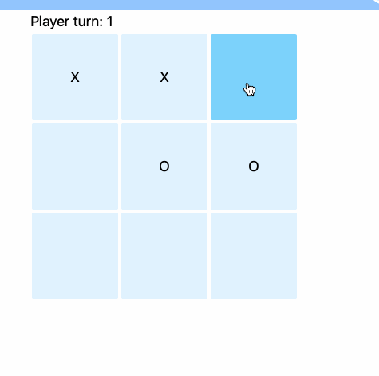

# What is this?

Tic-tac-toe in browser, made with Django, HTMX, Tailwind.

Years ago I flubbed an interview question that asked me to implement tictactoe in object oriented programming. Fast forward to now, I wanted to practice HTMX, so I figured I could take another crack at tictactoe and might as well make the game logic in an object oriented way to redeem myself. Along the way I found Tailwind CSS and took this chance to try that out too. So, simply a condensed way to practice Django, HTMX, OOP in Python, and Tailwind CSS. And why not practice making a decent readme :)

# Install:

First clone the project
```
python -m venv .venv
source ./venv/bin/activate
pip install -r requirements.txt
python manage.py migrate
```

To run:
```
python manage.py runserver
```

Go to http://127.0.0.1:8000/

# Concepts Used:
## hx-swap-oob
https://htmx.org/examples/update-other-content/#oob


## htmx events
https://htmx.org/examples/update-other-content/#events



## OOP Game logic
Seen in the playGame view. Because we're stateless, it will create a new Game object every POST in order to run the game logic.
## Tailwind
I like it!

# Useful scripts:

Start tailwind watcher, which generates css as you add classes to html:
```
tailwindcss -i ./tictactoe_app/static/tictactoe_app/input.css -o ./tictactoe_app/static/tictactoe_app/output.css --watch
```

Prune tailwind output, which takes out anything you aren't using:
```
tailwindcss -o ./tictactoe_app/static/tictactoe_app/output.css --minify
```
