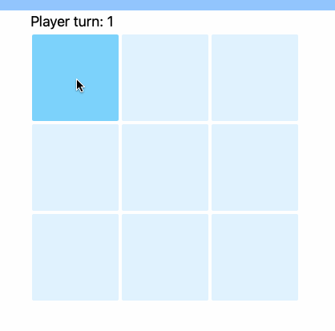

# What is this?

Tic-tac-toe in browser, made with Django, HTMX, Tailwind.

Years ago I flubbed an interview question that asked me to implement tictactoe in object oriented programming. Fast forward to now, I wanted to practice HTMX, so I figured I could take another crack at tictactoe and might as well make the game logic in an object oriented way to redeem myself. Along the way I found Tailwind CSS and took this chance to try that out too. So, simply a condensed way to practice Django, HTMX, OOP in Python, and Tailwind CSS. And why not practice making a decent readme :)

# Install:
```
pip install git+https://github.com/cookster9/django-htmx-tictactoe.git
```
Quick start
-----------

1. Add "tictactoe_app" to your INSTALLED_APPS setting like this::
```
    INSTALLED_APPS = [
        ...,
        "tictactoe_app",
    ]
```
2. Include the tictactoe URLconf in your project urls.py like this::

    path("tictactoe/", include("tictactoe_app.urls")),

3. Run ``python manage.py migrate`` to create the models.

4. Start the development server and visit the ``/tictactoe/`` URL to play.

# Url Reference
```
urlpatterns = [
    path('', views.startGame, name="startGame"),
    path('<int:pk>/', views.playGame, name='playGame'),
    path('<int:pk>/winner/', views.getWinner, name='getWinner'),
    path('games/', views.GameListView.as_view(), name='gameList'),
]
```

# Concepts Used:
## hx-swap-oob
HTMX's out of band swap, described here: https://htmx.org/examples/update-other-content/#oob

I'm using it to update text describing which player's turn it is above the board:



Relevant code in playGame view's http response:
```
http_response = """<div hx-swap-oob="outerHTML:#player-p">
                            <p id="player-p">Player turn: """+str(game.playerTurn)+"""</p>
                            </div>"""+game.board[square]
```

The response is primarily returning an X or an O to fill in the square. I tacked on the div with the hx-swap-oob attribute that updates the player turn as well.

It's not terribly intuitive in this use case tbh.

## HTMX events
HTMX events described here: https://htmx.org/examples/update-other-content/#events

Used to display the winner at the bottom of the board when the game is over, seen here:


Also seen in the playGame view. If the game is found to be over, an event trigger is passed in the response header:
```
response_obj=HttpResponse(http_response, content_type="text/html")
if(game.winner is not None):
    response_obj.headers['Hx-Trigger']='winnerFound'
```

Then a hidden hx-get will query the winner and display it at the bottom.
```
<p hx-get="/{{ id }}/winner/" hx-trigger="winnerFound from:body" hx-target="this" hx-swap="outerHTML" hidden>Winner</p>
```

## OOP Game logic
Seen in the playGame view. Because we're stateless, it will create a new Game object every POST in order to run the game logic.

## Tailwind
I like it!

# Useful scripts:

Start tailwind watcher, which generates css as you add classes to html:
```
tailwindcss -i ./tictactoe_app/static/tictactoe_app/input.css -o ./tictactoe_app/static/tictactoe_app/output.css --watch
```

Prune tailwind output, which takes out anything you aren't using:
```
tailwindcss -o ./tictactoe_app/static/tictactoe_app/output.css --minify
```
